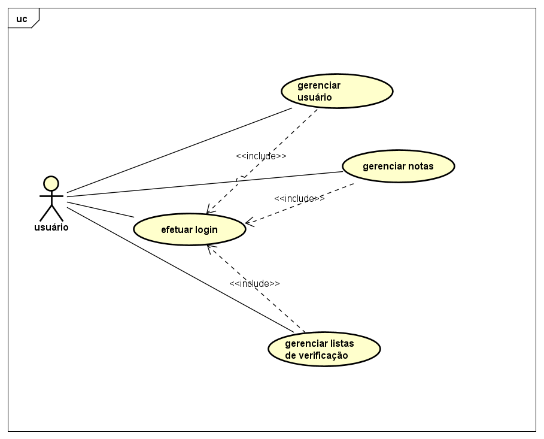
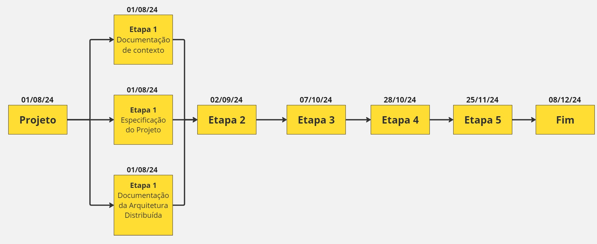
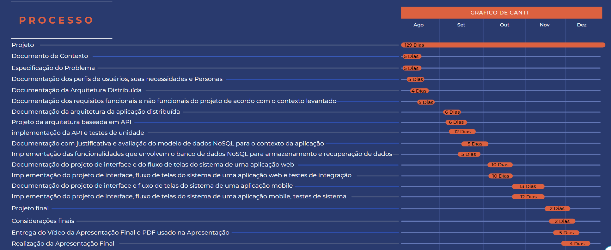
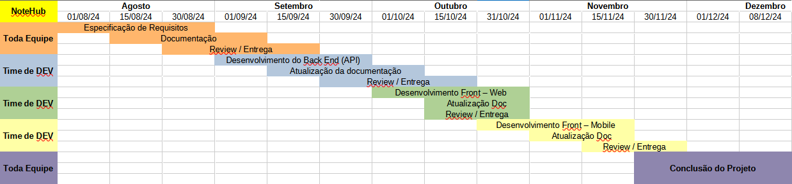
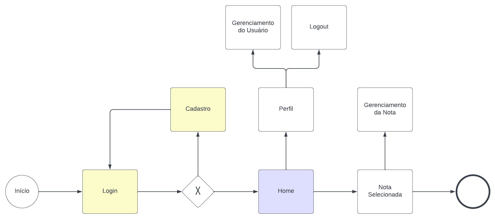
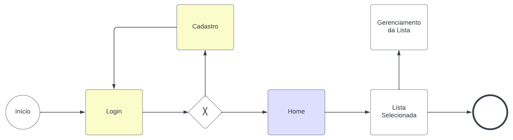
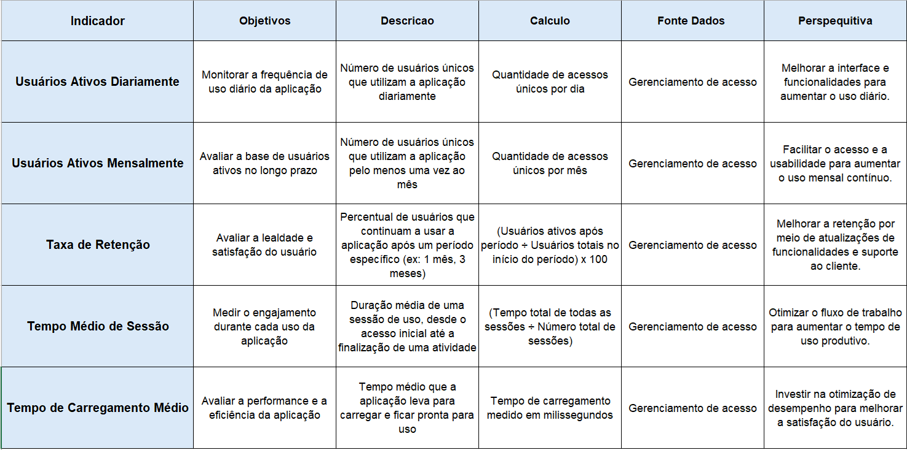
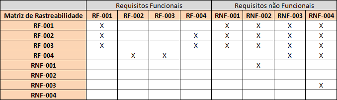

# Especificações do Projeto

Este capítulo desempenha um papel fundamental no desenvolvimento da aplicação destinada a facilitar doações aos necessitados. Apresentamos meticulosamente personas definidas, um esclarecedor diagrama de casos de uso, requisitos detalhados, uma matriz de rastreabilidade abrangente e estratégias eficazes de gerenciamento de projeto. Essa abordagem proporciona uma visão completa e integrada, onde cada elemento é cuidadosamente alinhado com nossos objetivos e metas estabelecidos, assegurando uma compreensão holística e direcionada do projeto.

## Personas

As personas levantadas durante o processo de entendimento do problema são apresentadas a seguir:

|  | Maíra Castrovêz | 
|-----------|------------| 
| **Idade:** | 51 anos |
| **Ocupação:** | Secretária |
| **Motivações:** |  Melhorar sua eficácia no seu ramo de trabalho  |
| **Frustrações:** | Dificuldade na gestação de tempo |
| **Aplicativos:** | *Instagram   *Facebook   *WhatsApp |
| **Como o sistema pode facilitar o trabalho?** | Facilita a gestação de tempo e agendamentos no seu ramo |

|  | Caíque Drummon | 
|-----------|------------| 
| **Idade:** | 48 anos |
| **Ocupação:** | Empresário |
| **Motivações:** | Caíque busca cada dia mais melhorar formas para otimizar seu tempo durante o dia a dia |
| **Frustrações:** | Caíque muitas vezes se encontra com dificuldade para gerir algumas empresas pois muitas vezes perde tempo durante o dia com coisas irrelevantes |
| **Aplicativos:** | *Instagram   *Facebook   *Zoom   *Twitter   *WhatsApp |
| **Como o sistema pode facilitar o trabalho?** | Esta aplicação pode auxiliar o Caíque a ter uma noção melhor sobre o tempo que é necessário para utilizar em cada empresa a qual ele ajuda na gestação |

|  | Heitor Vellani | 
|-----------|------------| 
| **Idade:** | 38 anos |
| **Ocupação:** | Consultor financeiro |
| **Motivações:** | Heitor é motivado por seu desejo de oferecer um excelente serviço a seus clientes e manter uma boa reputação no mercado. Ele valoriza a eficiência, a precisão e a capacidade de cumprir prazos, pois isso impacta diretamente na satisfação dos clientes e no sucesso de seu negócio. |
| **Frustrações:** | Heitor frequentemente se sente frustrado pela falta de tempo para completar todas as suas tarefas diárias. Ele se vê sobrecarregado com a quantidade de compromissos e a necessidade constante de gerenciar várias responsabilidades ao mesmo tempo. A desorganização e a dificuldade em priorizar tarefas importantes são outras frustrações. |
| **Aplicativos:** | *instagram   *telegram   *WhatsApp   *LinkdIn   *Teams. |
| **Como o sistema pode facilitar o trabalho?** | O sistema pode ajudar Heitor a organizar suas tarefas diárias de maneira mais eficaz, priorizando-as por urgência e importância. |

| | Gabriel Rossi | 
|-----------|------------| 
| **Idade:** | 25 anos |
| **Ocupação:** | Profissional Liberal (Arquitetura e Design de Interiores) |  
| **Motivações:** |  Manter-se organizado e produtivo, gerenciar prazos de projetos, ter acesso rápido às anotações e ideias durante reuniões com clientes..
| **Frustrações:** | Perda de ideias importantes por falta de organização, dificuldade em encontrar notas antigas rapidamente, excesso de aplicativos para gerenciar informações, e ferramentas complexas que tomam muito tempo para aprender a usar.  |
| **Aplicativos:** | *Instagram   *Facebook   *Microsoft Teams   *AutoCad |
| **Como o sistema pode facilitar o trabalho?** | O sistema pode centralizar todas as notas e ideias em um único lugar de fácil acesso, permitir a organização das notas em categorias ou projetos, possibilitar a busca rápida por palavras-chave e sincronizar em tempo real entre dispositivos. Integrações com outras ferramentas, como Microsoft Teams e AutoCad, também seriam valiosas para otimizar o fluxo de trabalho. |

|  | Sabrina Ricci | 
|-----------|------------| 
| **Idade:** | 30 anos |
| **Ocupação:** | Empresária (E-commerce de moda)|
| **Motivações:** | Gerenciar todas as tarefas do dia a dia, manter o controle sobre ideias de marketing e lançamentos de produtos, criar listas de afazeres e prazos. |
| **Frustrações:** | Dificuldade em acompanhar várias tarefas ao mesmo tempo, falta de um sistema simples para anotações rápidas, sobrecarga de informações e perda de dados importantes por não ter backup constante. |
| **Aplicativos:** | *Instagram   *Facebook   *Whatsapp |
| **Como o sistema pode facilitar o trabalho?** | O sistema pode permitir a criação rápida de listas de tarefas, sincronizar automaticamente com a nuvem para evitar perdas de dados, oferecer lembretes para prazos importantes e possibilitar a organização das notas em categorias específicas para cada área do negócio. Funcionalidades de colaboração, como compartilhamento de notas e listas com a equipe, também seriam essenciais. |

|  | Camila Schneider| 
|-----------|------------| 
| **Idade:** | 18 anos |
| **Ocupação:** | Estudante Universitário (Engenharia)|
| **Motivações:** | Organizar materiais de estudo, criar resumos para provas, gerenciar tarefas e prazos de trabalhos acadêmicos, anotar ideias e informações relevantes durante as aulas. |
| **Frustrações:** | Dificuldade em manter o controle de múltiplas disciplinas, perder prazos importantes, necessidade de acessar notas e materiais em diferentes dispositivos, e confusão ao procurar informações anotadas de maneira desorganizada. |
| **Aplicativos:** | *Instagram   *Facebook   *Whatsapp |
| **Como o sistema pode facilitar o trabalho?** | O sistema pode ajudar na criação de resumos rápidos e organizados por disciplina, oferecer lembretes para prazos de entrega e provas, sincronizar notas automaticamente entre dispositivos para acesso em qualquer lugar, e permitir a busca eficiente por tópicos específicos. Além disso, a integração com outras ferramentas de estudo, como Google Drive, seria um diferencial importante. |

## Histórias de Usuários

Com base na compreensão do dia-a-dia das funções identificadas para o projeto, as histórias de usuário estão documentadas a seguir:

|EU COMO... `PERSONA`| QUERO/PRECISO ... `FUNCIONALIDADE` |PARA ... `MOTIVO/VALOR`                 |
|--------------------|------------------------------------|----------------------------------------|
| Maíra Castrovêz | Organizar a agenda do seu trabalho para otimizar o tempo | Buscar os agendamentos com facilidade durante um atendimento |
| Caíque Drummon | Preferência por uma interface simples, porém abrangente | Livre de anúncios, garantindo usabilidade eficiente |
| Heitor Vellani | Uma aplicação que fornece o necessário para melhorar ainda mais minhas entregas de forma excelente | Otimizando a entrega pontual de prazos para seus clientes. |
| Gabriel Rossi | Organizar minhas anotações de ideias e projetos em categorias específicas | Acessar rapidamente informações relevantes durante reuniões com clientes e garantir que nenhum detalhe seja perdido |
| Sabrina Ricci| Criar listas de tarefas diárias e definir lembretes automáticos	 | Gerenciar melhor meu tempo e garantir que todos os prazos importantes sejam cumpridos. |
| Camila Schneider | Criar resumos rápidos e organizados por disciplina, com sincronização automática entre dispositivos	 | Facilitar o estudo, acessar minhas anotações em qualquer lugar, e garantir que não perca informações importantes |

<!--## Modelagem do Processo de Negócio -->
## Requisitos

As tabelas que se seguem apresentam os requisitos funcionais e não funcionais que detalham o escopo do projeto. Para determinar a prioridade de requisitos, aplicar uma técnica de priorização de requisitos e detalhar como a técnica foi aplicada.

### Requisitos Funcionais

|ID    | Descrição do Requisito  | Prioridade |
|------|-----------------------------------------|----|
|RF-001| A aplicação deve permitir operações básicas de CRUD para usuários, incluindo cadastro, login, e gerenciamento de contas | ALTA | 
|RF-002| A aplicação deve permitir operações básicas de CRUD (criação, leitura, atualização e exclusão) para notas | ALTA |
|RF-003| A aplicação deve permitir operações básicas de CRUD (criação, leitura, atualização e exclusão) para listas de verificação | ALTA |
|RF-004| A aplicação deve possuir um sistema de busca para localização das notas/listas | MÉDIA |

### Requisitos não Funcionais

|ID     | Descrição do Requisito  |Prioridade |
|-------|-------------------------|----|
|RNF-001| A aplicação deve garantir a segurança dos dados armazenados através de criptografia e autenticação segura para proteger a privacidade do usuário | ALTA | 
|RNF-002| A aplicação deve ser capaz de suportar um numero moderado de usuários e notas, mantendo uma performance aceitável sem degradação significativa | ALTA |
|RNF-003| O design da aplicação deve ser intuitivo e fácil de usar, promovendo uma experiência de usuário agradável e eficiente | ALTA |
|RNF-004| A aplicação deve ser desenvolvida utilizando React para a web e React Native para dispositivos móveis, garantindo a consistência do código e facilidade de manutenção | ALTA |

## Restrições

O projeto está restrito pelos itens apresentados na tabela a seguir.

|ID| Restrição                                             |
|--|-------------------------------------------------------|
|01| Conclusão do projeto em 6 meses. |
|02| Minimizar dependência de serviços de terceiros para funcionalidades críticas. |
|03| O aplicativo deve ser projetado para funcionar em dispositivos móveis e desktops com uma experiência de usuário consistente. |
|04| O aplicativo funcionará apenas se o usuário possuir internet. |

## Diagrama de Casos de Uso

O diagrama de casos de uso é o próximo passo após a elicitação de requisitos, que utiliza um modelo gráfico e uma tabela com as descrições sucintas dos casos de uso e dos atores. Ele contempla a fronteira do sistema e o detalhamento dos requisitos funcionais com a indicação dos atores, casos de uso e seus relacionamentos. 

# Gerenciamento de Projeto

De acordo com o PMBoK v6 as dez áreas que constituem os pilares para gerenciar projetos, e que caracterizam a multidisciplinaridade envolvida, são: Integração, Escopo, Cronograma (Tempo), Custos, Qualidade, Recursos, Comunicações, Riscos, Aquisições, Partes Interessadas. Para desenvolver projetos um profissional deve se preocupar em gerenciar todas essas dez áreas. Elas se complementam e se relacionam, de tal forma que não se deve apenas examinar uma área de forma estanque. É preciso considerar, por exemplo, que as áreas de Escopo, Cronograma e Custos estão muito relacionadas. Assim, se eu amplio o escopo de um projeto eu posso afetar seu cronograma e seus custos.

## Gerenciamento de Tempo

A gestão do tempo em um projeto é fundamental para garantir que todas as atividades sejam concluídas dentro do prazo estabelecido. É um processo que envolve a identificação e o planejamento das tarefas necessárias para atingir os objetivos do projeto, bem como a alocação eficiente dos recursos disponíveis. Em resumo, a gestão do tempo em um projeto envolve a definição clara de metas e prazos, a identificação e priorização das tarefas mais importantes e o acompanhamento constante do progresso. Com uma gestão eficaz do tempo, é possível aumentar a produtividade, reduzir custos e garantir a entrega do projeto dentro do prazo e do orçamento previstos.

"O tempo é o recurso mais escasso e, a menos que seja gerenciado, nada mais pode ser gerenciado." - Peter Drucker

| Nome da Tarefa |  Duração  |   Início   |  Término   |
|----------------|-----------|------------|------------|
|     Projeto    |  129 Dias | 01/08/2024 | 08/12/2024 |
|     Etapa 1    |  31 Dias  | 01/08/2024 | 01/09/2024 |
|     Etapa 2    |  34 Dias  | 02/09/2024 | 06/10/2024 |
|     Etapa 3    |  20 Dias  | 07/10/2024 | 27/10/2024 |
|     Etapa 4    |  27 Dias  | 28/10/2024 | 24/11/2024 |
|     Etapa 5    |  13 Dias  | 25/11/2024 | 08/12/2024 |

O gráfico de Gantt foi criado para representar o tempo necessário para cada atividade a ser desenvolvida ao longo do projeto, facilitando a visualização das tarefas, sua duração, dependências e prazos. Ele organiza as atividades em uma linha do tempo, permitindo que a equipe do projeto acompanhem o progresso, identifiquem gargalos e garantam que o cronograma do projeto seja cumprido.

## Gerenciamento de Equipe

A boa administração das atividades é essencial para garantir que o projeto atinja uma performance elevada. Dessa forma, é crucial realizar um controle eficiente tanto das tarefas quanto das equipes, permitindo que os grupos responsáveis pelo projeto sejam geridos de maneira eficaz. 

<!--
## Análise da Situação Atual
Atualmente, muitas pessoas enfrentam dificuldades para se manter organizadas diante da grande quantidade de tarefas e responsabilidades do dia a dia. A falta de uma organização eficaz pode levar ao estresse e à sensação de estar sempre sobrecarregado, dificultando o gerenciamento das atividades pessoais e profissionais.

## Descrição Geral da Proposta
A proposta da nossa aplicação é fornecer uma solução prática e intuitiva para o gerenciamento de notas e listas. O objetivo é ajudar as pessoas a organizarem suas tarefas de maneira mais eficiente, permitindo que mantenham o controle sobre suas atividades diárias e reduzam o estresse associado à falta de organização.

### Processo 1 – GERENCIAMENTO DE NOTAS

### Processo 2 – GERENCIAMENTO DE LISTAS

## Indicadores de Desempenho

Apresente aqui os principais indicadores de desempenho e algumas metas para o processo. Atenção: as informações necessárias para gerar os indicadores devem estar contempladas no diagrama de classe. Colocar no mínimo 5 indicadores.

Obs.: todas as informações para gerar os indicadores devem estar no diagrama de classe a ser apresentado a posteriori.

# Matriz de Rastreabilidade

## Gestão de Orçamento

O processo de determinar o orçamento do projeto é uma tarefa que depende, além dos produtos (saídas) dos processos anteriores do gerenciamento de custos, também de produtos oferecidos por outros processos de gerenciamento, como o escopo e o tempo.

-->