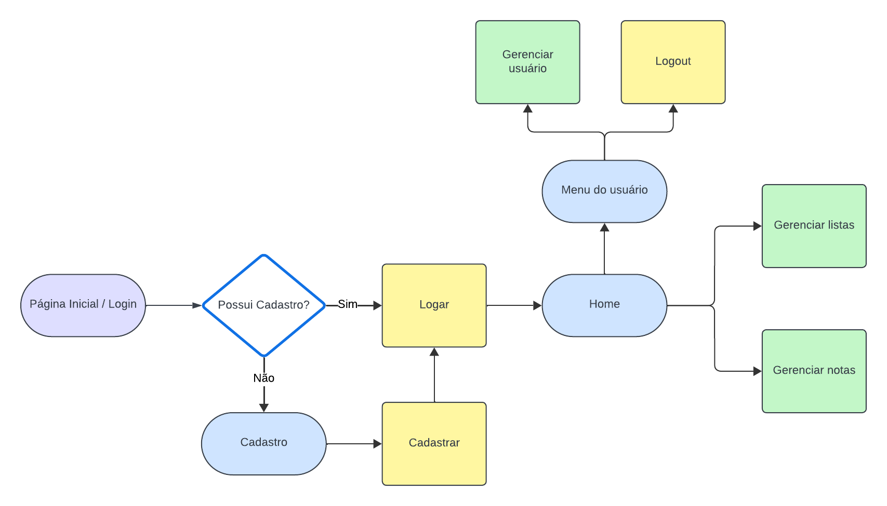
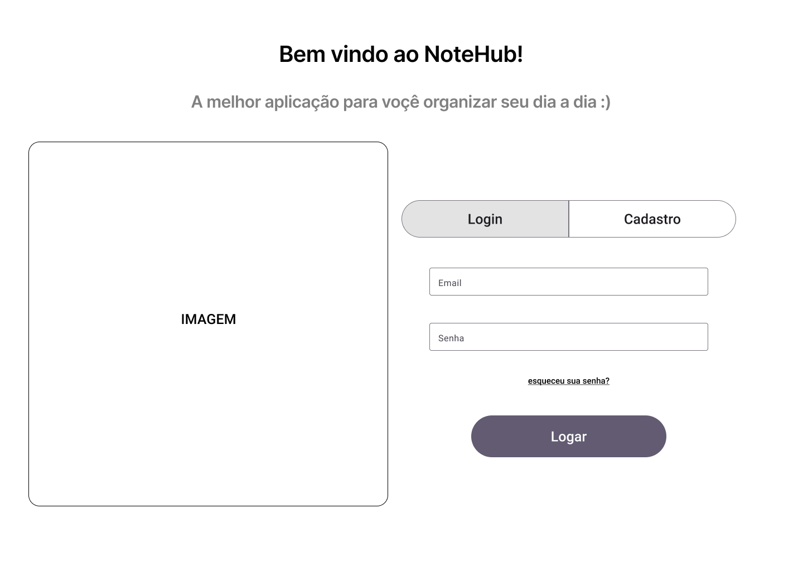
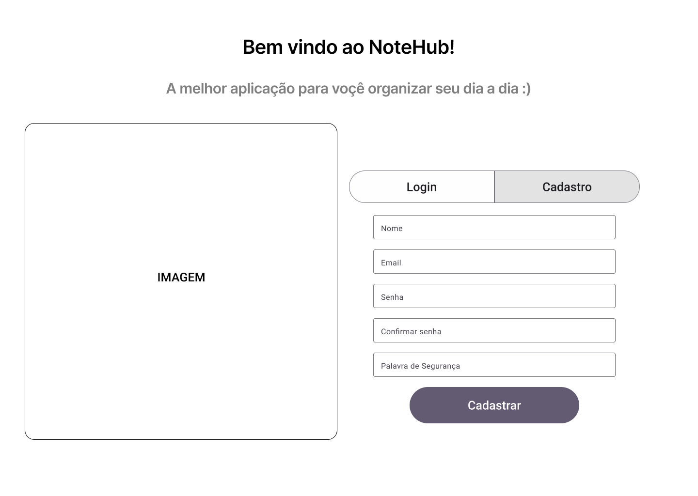
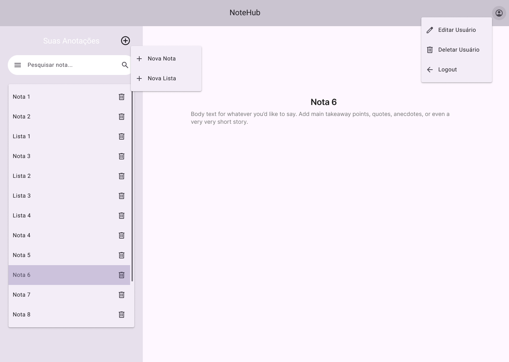
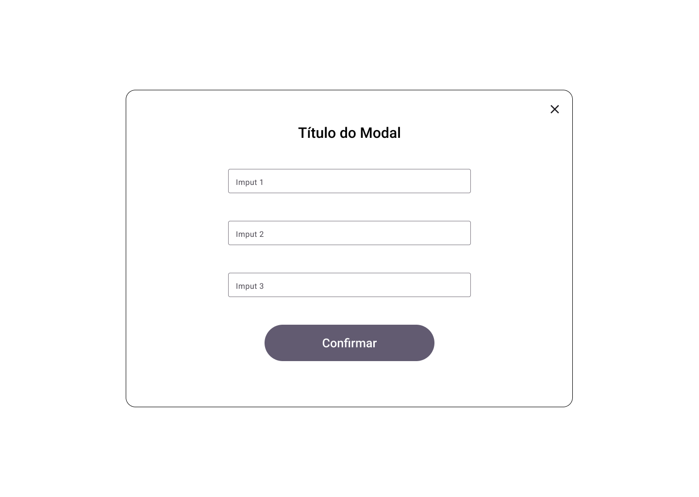

# Projeto de Interface

## Diagrama de Fluxo

## Wireframes - WEB

### Tela Inicial - Login

### Tela Inicial - Cadastro

### Tela Principal

### Estilo Padronizado do Modal

## Wireframes - MOBILE

### Tela Inicial - Login

### Tela Inicial - Cadastro

### Tela Principal

### Tela Perfil do Usuário

### Estilo Padronizado do Modal

