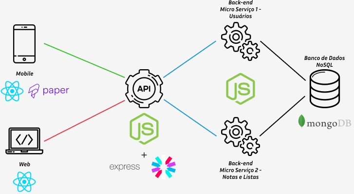
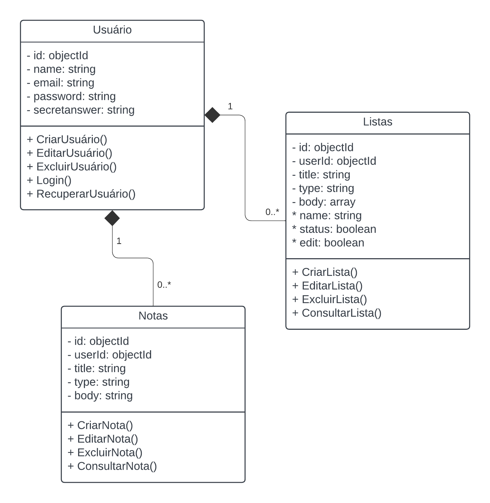
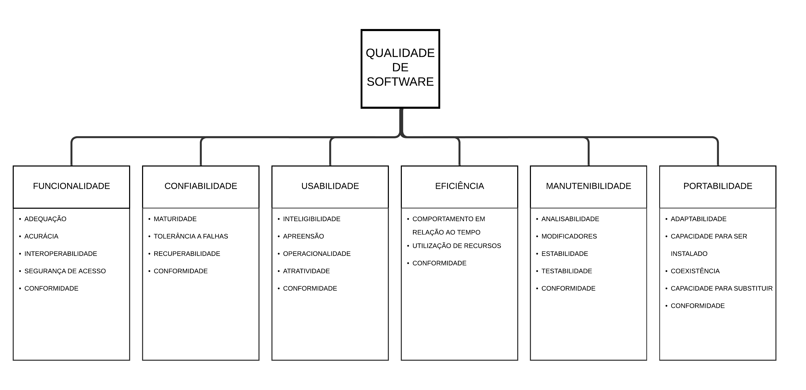

# Arquitetura da Solução

Definição de como o software é estruturado em termos dos componentes que fazem parte da solução e do ambiente de hospedagem da aplicação.



## Diagrama de Classes

O diagrama de classes ilustra graficamente como será a estrutura do software, e como cada uma das classes da sua estrutura estarão interligadas. Essas classes servem de modelo para materializar os objetos que executarão na memória.



## Documentação do Banco de Dados MongoDB

Este documento descreve a estrutura e o esquema do banco de dados não relacional utilizado por nosso projeto, baseado em MongoDB. O MongoDB é um banco de dados NoSQL que armazena dados em documentos JSON (ou BSON, internamente), permitindo uma estrutura flexível e escalável para armazenar e consultar dados.

## Esquema do Banco de Dados

### Coleção: users
Armazena as informações dos usuários do sistema.

Estrutura do Documento

```Json
{
    "_id": "ObjectId('5f7e1bbf9b2a4f1a9c38b9a1')",
    "name": "Pedro Andrade",
    "email": "pedro.andrade@example.com",
    "password": "hash_da_senha",
    "secretanswer": "exemplo",
}
```

#### Descrição dos Campos
> - <strong>_id:</strong> Identificador único do usuário gerado automaticamente pelo MongoDB.
> - <strong>name:</strong> Nome completo do usuário.
> - <strong>email:</strong> Endereço de email do usuário.
> - <strong>password:</strong> Hash da senha do usuário.
> - <strong>secretanswer:</strong> Resposta da pergunta de segurança.

### Coleção: notes
Armazena as informações das notas criadas pelos usuários.

Estrutura do Documento

```Json
{
    "_id": "ObjectId('5f7e1ccf9b2a4f1a9c38b9b3')",
    "userId": "ObjectId('5f7e1ccf9b2a4f1a9c38b9a2')",
    "title": "Exemplo de título",
    "type": "nota",
    "body": "Exemplo de nota.",
}
```
### Descrição dos Campos
> - <strong>_id:</strong> Identificador único da nota gerado automaticamente pelo MongoDB.
> - <strong>usuarioId:</strong> Referência ao identificador do usuário que criou a nota.
> - <strong>title:</strong> Título da nota.
> - <strong>type:</strong> Tipo do elemento (nota ou lista).
> - <strong>body:</strong> Conteúdo da nota.

### Coleção: checklists
Armazena as informações das listas de verificação criadas pelos usuários.

Estrutura do Documento

```Json
{
    "_id": "ObjectId('5f7e1ccf9b2a4f1a9c38b9b3')",
    "userId": "ObjectId('5f7e1ccf9b2a4f1a9c38b9a2')",
    "title": "Exemplo de título",
    "type": "lista",
    "body": [{
                "name": "nome do item",
                "status": "true",
                "edit: false"
            }],
}
```
### Descrição dos Campos
> - <strong>_id:</strong> Identificador único da lista de verificação gerado automaticamente pelo MongoDB.
> - <strong>usuarioId:</strong> Referência ao identificador do usuário que criou a lista.
> - <strong>title:</strong> Título da lista.
> - <strong>type:</strong> Tipo do elemento (nota ou lista).
> - <strong>body:</strong> conjunto dos elementos da lista.
> - <strong>name:</strong> nome de cada elemento.
> - <strong>status:</strong> Indica se o item foi marcado como concluído (true) ou não (false).
> - <strong>edit:</strong> Indica se o item foi marcado como editado (true) ou não (false).


## Tecnologias Utilizadas

Nossa solução abrange diversas tecnologias para desenvolvimento web e móvel, design de interface, gerenciamento de banco de dados, controle de versão e mais. Algumas das principais tecnologias que estamos utilizando incluem:

- Visual Studio Code - Um editor de código leve e altamente personalizável para desenvolvimento de software.

- Expo - Um conjunto de ferramentas e serviços que facilita o desenvolvimento de aplicativos móveis com React Native, oferecendo um ambiente rápido para prototipagem e desenvolvimento.

- MongoDB - Um banco de dados NoSQL orientado a documentos que armazena dados em formato JSON flexível, permitindo escalabilidade e performance em grandes volumes de dados.

- Azure - A plataforma de computação em nuvem da Microsoft que oferece uma ampla gama de serviços, como hospedagem, banco de dados e soluções para armazenamento e redes.

- Git - Um sistema de controle de versão distribuído amplamente utilizado para rastrear mudanças no código fonte durante o desenvolvimento de software.

- GitHub - Uma plataforma de hospedagem de código fonte baseada em Git que oferece controle de versão e colaboração para projetos de software.

- React Native - Um framework JavaScript para desenvolvimento de aplicativos móveis multiplataforma.

- Node.js - Um ambiente de execução JavaScript de alto desempenho, utilizado principalmente no desenvolvimento backend para criar aplicações escaláveis, com suporte para operações assíncronas e alta capacidade de processamento de requisições.

- Express - Um framework web minimalista para Node.js, amplamente utilizado para construir APIs e aplicações web, oferecendo uma sintaxe simples e flexível para lidar com rotas, requisições HTTP e middleware.

- React Native Paper - Uma biblioteca de componentes UI para React Native, que segue as diretrizes de design do Material Design, proporcionando uma interface consistente e acessível para o desenvolvimento de aplicativos móveis com foco em design moderno, responsivo e boa experiência do usuário.

- JWT - Um padrão aberto para autenticação e troca de informações seguras entre partes, usado frequentemente em aplicações web para autenticar e autorizar usuários através de tokens codificados e assinados digitalmente.

- LucidChart - Uma ferramenta de diagramação e visualização de dados baseada na web para criar diagramas, wireframes e fluxogramas.

## Hospedagem

Teremos o banco de dados e a publicação da aplicação web realizados através dos serviços do Azure. Já a aplicação mobile não será hospedada, mas será gerado o 'apk' para a instalação.

## Qualidade de Software

Para padronizar a avaliação da qualidade do software em nosso projeto, iremos adotar os padrões da norma ISO/IEC 9126, atualizada pela norma ISO/IEC 25010. Essas normas propõem atributos de qualidade divididos em características principais e subcaracterísticas, como os apresentados a seguir:



**Funcionalidade**:
 - *Interoperabilidade*: O sistema cumpre esse critério com a sua capacidade de interagir com sistemas Android.
 - *Segurança de acesso*: O sistema implementa esse critério a partir da autenticação de usuários, com senha criptografada no banco de dados.

**Confiabilidade**:
 - *Tolerância a falhas*: O sistema implementa esse critério através das avaliações pelos testes de usabilidade.

**Usabilidade**:
 - *Inteligibilidade*: O sistema implementa esse critério através das avaliações pelos testes de usabilidade.
 - *Apreensibilidade*: O sistema implementa esse critério através das avaliações pelos testes de usabilidade.

**Manutenibilidade**:
 - *Modificabilidade*: O sistema cumpre esse critério através da implementação e ajuste de funcionalidades.
