| **Caso de Teste** | **CT-01 – Cadastrar Usuário** |
|:---:|:---:|
| Requisito Associado | RF-001 - A aplicação deve permitir operações básicas de CRUD para usuários, incluindo cadastro, login, e gerenciamento de contas. |
| Objetivo do Teste | Verificar se a aplicação permite o cadastro adequado de usuários. |
| Instruções | - Acessar a aplicação Web ou Mobile   - Clicar em "Cadastrar"   - Informar os dados necessários para o cadastro   - Confirmar cadastro |
| Critério de Êxito | O cadastro do usuário deve ser efetuado com sucesso. |
| Execução de Teste - WEB | 1.	Acessando tela de cadastrar novo usuário  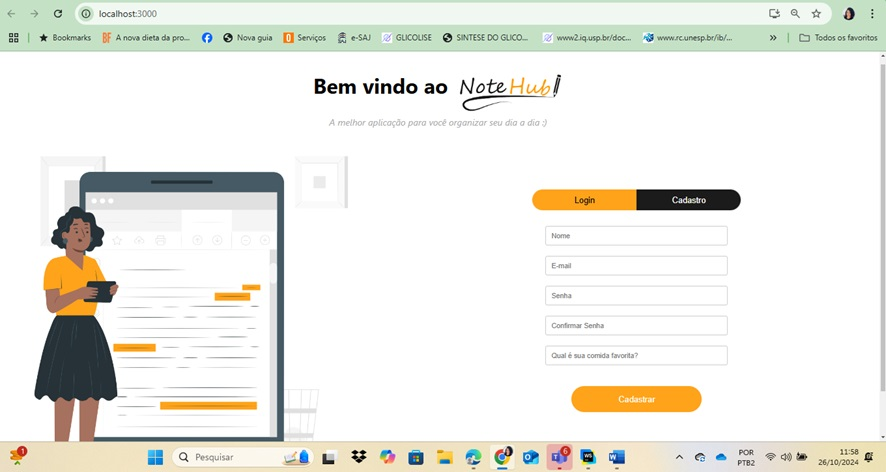  2.	Preenchendo os dados do novo usuário 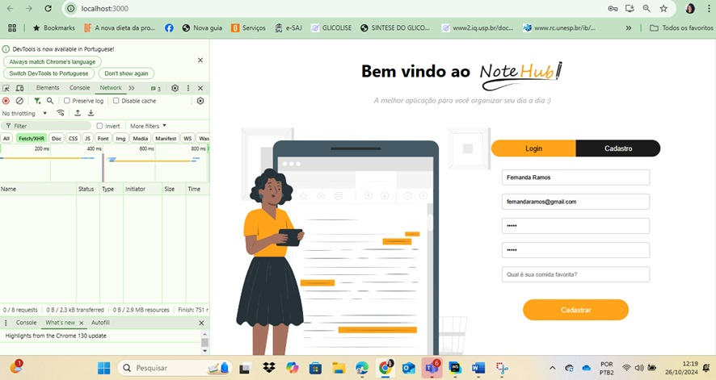  3.	Usuário cadastrado com sucesso 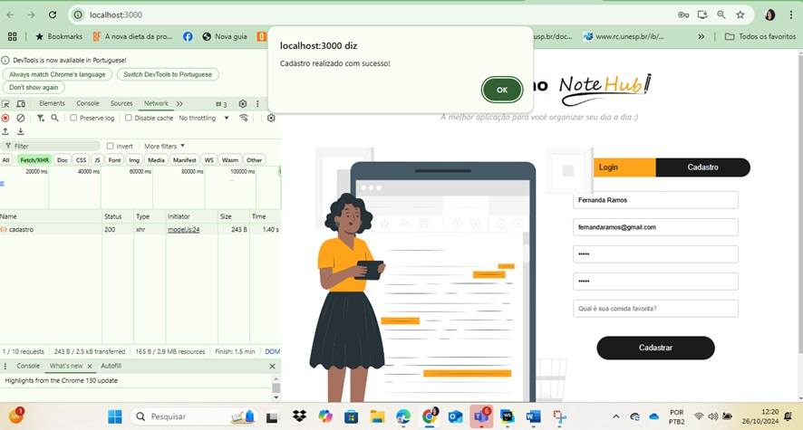   4.	Usuário salvo no banco de dados e id gerado 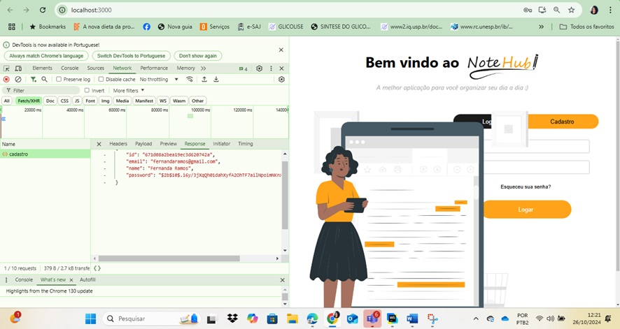|
| Execução de Teste - MOBILE | 1.	Acessando tela de cadastrar novo usuário   2.	Preenchendo os dados do novo usuário   3.	Usuário cadastrado com sucesso |
| | |
| **Caso de Teste** | **CT-02 – Login** |
| Requisito Associado | RF-001 - A aplicação deve permitir operações básicas de CRUD para usuários, incluindo cadastro, login, e gerenciamento de contas. |
| Objetivo do Teste | Vereficar se o email e senha estão corretos e o usuário consegue acessar o sistema. |
| Instruções | - Acessar a aplicação Web ou Mobile   - Clicar em "Login"   - Informar os dados necessários para o login   - Clicar em "logar" |
| Critério de Êxito | Usuário logado com sucesso. |
| Execução de Teste - WEB | 1.	Login de um usuário existente  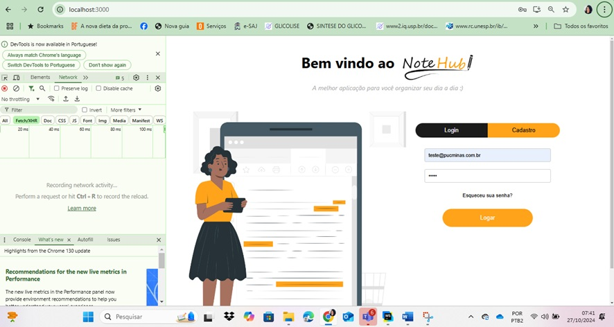 2.	Realizando o login 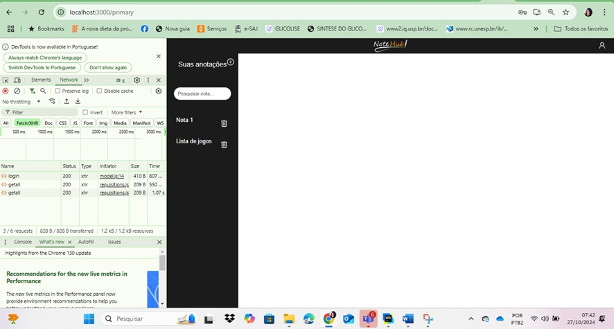  3.	Token de verificação gerado 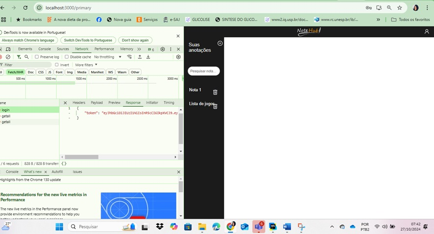  |
| Execução de Teste - MOBILE | 1.	Login de um usuário existente   2.	Realizando o login  |
| | |
| **Caso de Teste** | **CT-03 – Gerenciar Usuário** |
| Requisito Associado | RF-001 - A aplicação deve permitir operações básicas de CRUD para usuários, incluindo cadastro, login, e gerenciamento de contas. |
| Objetivo do Teste | Verificar se o Usuário consegue fazer alterações em "email" "senha" "nome". |
| Instruções | - Acessar a aplicação Web ou Mobile   - Clicar em "Gerenciar Usuário"    - Clicar em "Editar Usuário"    - Fazer as alterações   - Confirmar alterações |
| Critério de Êxito | Alterações realizadas com sucesso. |
| Execução de Teste - WEB | 1.	Abrindo menu do usuário logado    2.	Modal de Edição    3.	Edição resalizada com sucesso   |
| Execução de Teste - MOBILE | 1.	Abrindo menu do usuário logado    2.	Modal de Edição    3.	Edição resalizada com sucesso   |
| | |
| **Caso de Teste** | **CT-04 – Deletar Usuário** |
| Requisito Associado | RF-001 - A aplicação deve permitir operações básicas de CRUD para usuários, incluindo cadastro, login, e gerenciamento de contas. |
| Objetivo do Teste | Verificar se o Usuário consegue deletar seu usuário. |
| Instruções | - Acessar a aplicação Web ou Mobile   - Clicar em "Gerenciar Usuário"   - Clicar em "Deletar Usuário"   - Confirmar |
| Critério de Êxito | Usuário deletado com sucesso. |
| Execução de Teste - WEB | 1.	Função de exclusão de usuário  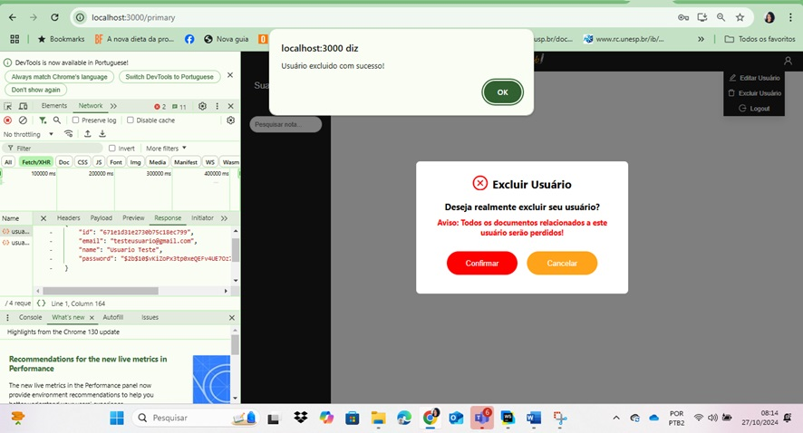 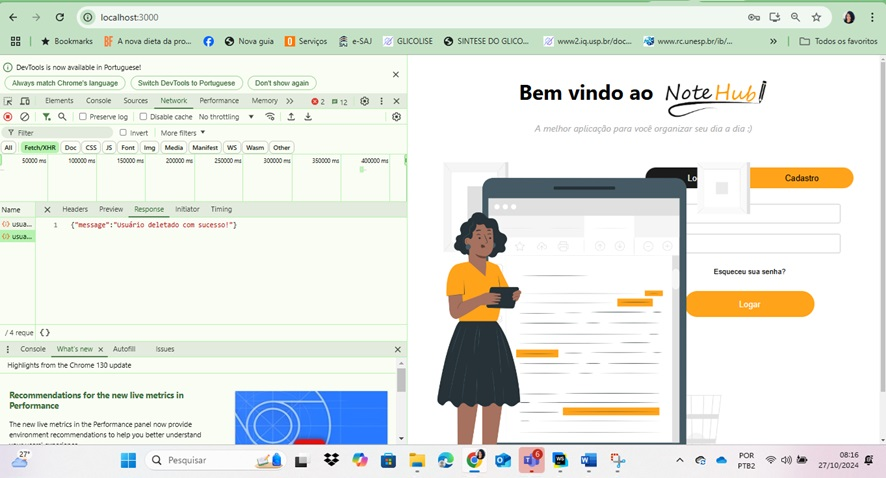 2.	Usuário deletado, login não pode ser realizado 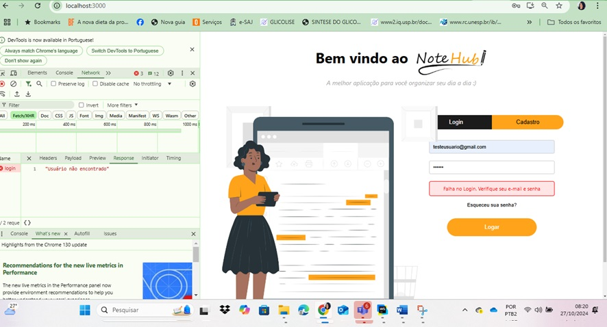  |
| Execução de Teste - MOBILE| 1.	Função de exclusão de usuário   2.	Usuário deletado   |
| | |
| **Caso de Teste** | **CT-05 – Criar notas** |
| Requisito Associado | RF-002 - A aplicação deve permitir operações básicas de CRUD (criação, leitura, atualização e exclusão) para notas. |
| Objetivo do Teste | Verificar se a aplicação permite a criação de notas. |
| Instruções | - Acessar a aplicação Web ou Mobile   - Clicar em "+"   - Clicar em "Nova nota" |
| Critério de Êxito | A criação da nota deve ser criada com sucesso. |
| Execução de Teste - WEB | 1.	Abrir o menu de criação de notas    2. Nota criada  |
| Execução de Teste - MOBILE | 1.	Abrir o menu de criação de notas    2. Nota criada   |
| | |
| **Caso de Teste** | **CT-06 – Acessar a notas** |
| Requisito Associado | RF-002 - A aplicação deve permitir operações básicas de CRUD (criação, leitura, atualização e exclusão) para notas. |
| Objetivo do Teste | Verificar se a aplicação permite acesso a nota criada e visualizar. |
| Instruções | - Acessar a aplicação Web ou Mobile   - Clicar em uma nota   - Visualizar conteúdo |
| Critério de Êxito | O Usuário consegue ler o conteúdo da nota. |
| Execução de Teste - WEB | 1.	Exibição da nota cadastrada  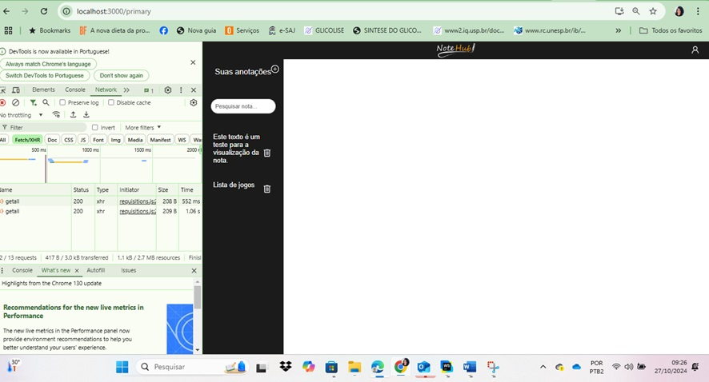 2.	Nota cadastrada sendo exibida 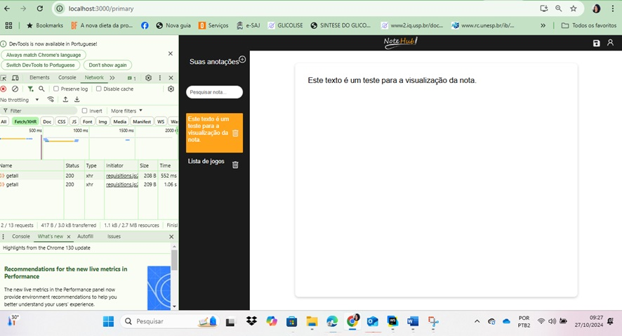 |
| Execução de Teste - MOBILE | 1.	Exibição da nota cadastrada    2. Nota cadastrada sendo exibida   |
| | |
| **Caso de Teste** | **CT-07 – Atualizar notas** |
| Requisito Associado | RF-002 -A aplicação deve permitir operações básicas de CRUD (criação, leitura, atualização e exclusão) para notas. |
| Objetivo do Teste | Verificar se o usuário consegue atualizar as notas. |
| Instruções | - Acessar a aplicação Web ou Mobile   - Clicar no nome da nota desejável   - Fazer atualizações   - Confirmar |
| Critério de Êxito | Usuário consegue observar que a nota foi atualizada. |
| Execução de Teste - WEB | 1.	Nota atualizada   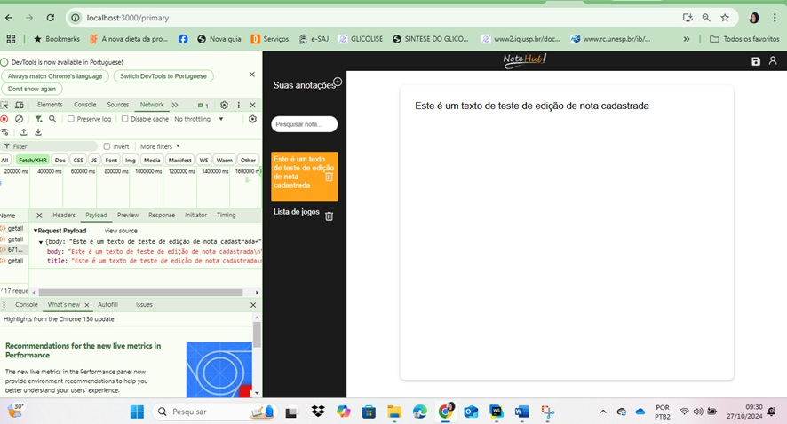  |
| Execução de Teste - MOBILE| 1.	Nota editada    2.	Nota atualizada    |
| | |
| **Caso de Teste** | **CT-08 – Excluir notas** |
| Requisito Associado | RF-002 - A aplicação deve permitir operações básicas de CRUD (criação, leitura, atualização e exclusão) para notas. |
| Objetivo do Teste | Verificar se o Usuário consegue excluir notas. |
| Instruções | - Acessar a aplicação Web ou Mobile   - Clicar na nota desejável   - Clicar em "🗑️"   - Confirmar |
| Critério de Êxito | O Usuário visualizar que a nota foi deletada com sucesso. |
| Execução de Teste - WEB | 1.	Nota excluída e não consta no banco de dados   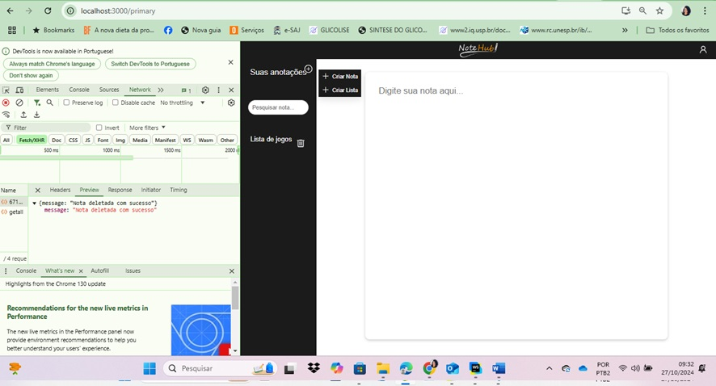  |
| Execução de Teste - MOBILE | 1.	Nota excluída    |
| | |
| **Caso de Teste** | **CT-09 – Criar listas** |
| Requisito Associado | RF-003 - A aplicação deve permitir operações básicas de CRUD (criação, leitura, atualização e exclusão) para listas de verificação. |
| Objetivo do Teste | Verificar se a aplicação permite a criação de listas. |
| Instruções | - Acessar a aplicação Web ou Mobile   - Clicar em "+"   - Clicar em "Nova lista" |
| Critério de Êxito | A criação da lista deve ser criada com sucesso. |
| Execução de Teste | 1.	Abrir o menu de criação de notas   2. Lista criada  |
| | |
| **Caso de Teste** | **CT-10 – Acessar a Listas** |
| Requisito Associado | RF-003 - A aplicação deve permitir operações básicas de CRUD (criação, leitura, atualização e exclusão) para listas de verificação. |
| Objetivo do Teste | Verificar se a aplicação permite acesso a lista criada e visualizar. |
| Instruções | - Acessar a aplicação Web ou Mobile   - Clicar em uma lista   - Visualizar conteúdo |
| Critério de Êxito | O Usuário consegue ler o conteúdo da lista. |
| Execução de Teste | 1.	Exibição da lista cadastrada   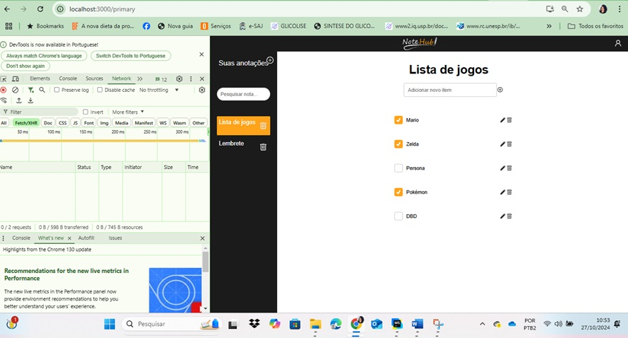  |
| | |
| **Caso de Teste** | **CT-11 – Atualizar Listas** |
| Requisito Associado | RF-003 - A aplicação deve permitir operações básicas de CRUD (criação, leitura, atualização e exclusão) para listas de verificação. |
| Objetivo do Teste | Verificar se o usuário consegue atualizar as listas. |
| Instruções | - Acessar a aplicação Web ou Mobile   - Clicar no nome da lista desejável   - Fazer atualizações   - Confirmar |
| Critério de Êxito | Usuário consegue observar que a lista foi atualizada. |
| Execução de Teste | 1.	Lista atualizada   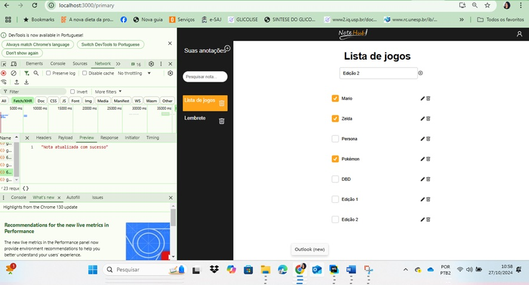  |
| | |
| **Caso de Teste** | **CT-12 – Excluir Listas** |
| Requisito Associado | RF-003 - A aplicação deve permitir operações básicas de CRUD (criação, leitura, atualização e exclusão) para listas de verificação. |
| Objetivo do Teste | Verificar se o Usuário consegue excluir listas. |
| Instruções | - Acessar a aplicação Web ou Mobile   - Clicar na lista desejável   - Clicar em "🗑️"   - Confirmar |
| Critério de Êxito | O Usuário visualizar que a lista foi deletada com sucesso. |
| Execução de Teste | 1.	Exclusão da lista   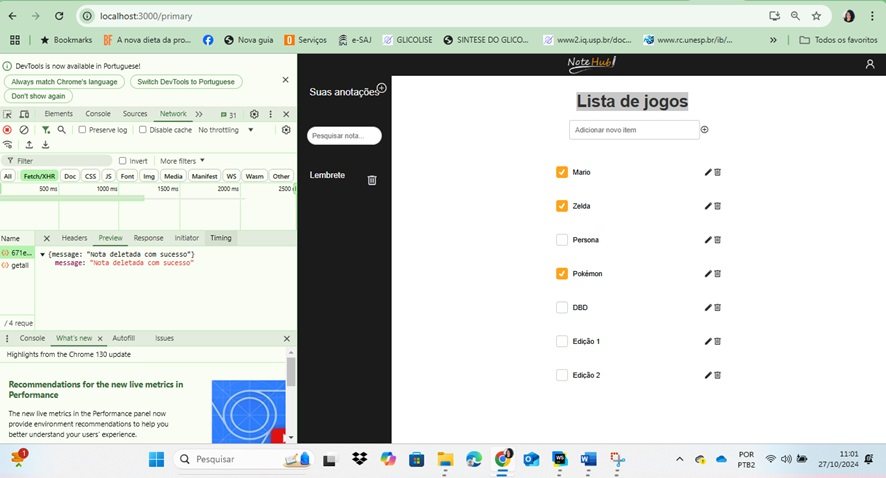  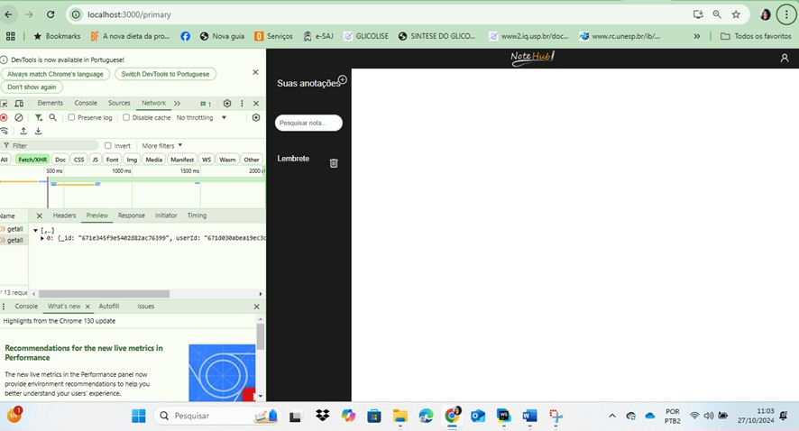 |
| | |
| **Caso de Teste** | **CT-13 – Busca de notas e listas** |
| Requisito Associado | RF-004 - A aplicação deve possuir um sistema de busca para localização das notas/listas |
| Objetivo do Teste | Verificar se o Usuário consegue buscar notas e listas. |
| Instruções | - Acessar a aplicação Web ou Mobile   - Clicar na barra de pesquisar   - digitar nome da nota ou lista   - Clicar no nome da nota ou lista |
| Critério de Êxito | O Usuário visualizar que a nota ou a lista foi localizada. |
| Execução de Teste - WEB | 1.	Visualizar lista    2.	Lista filtrada   |
| Execução de Teste - MOBILE| 1.	Visualizar lista    2.	Lista filtrada   |
| | |
